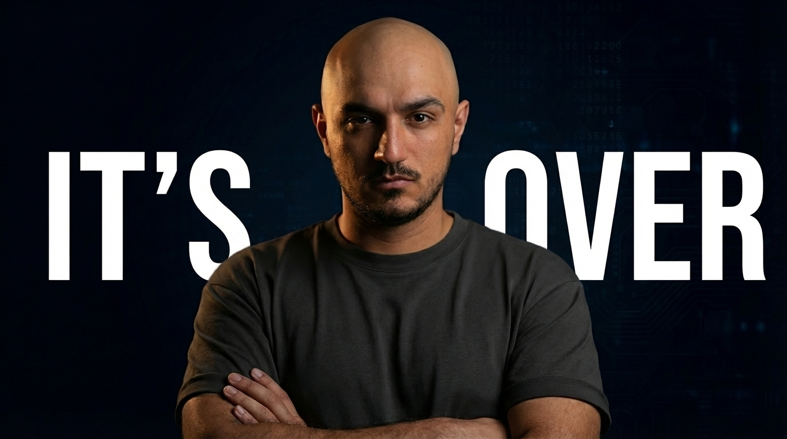
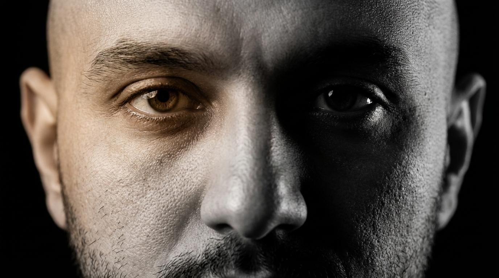
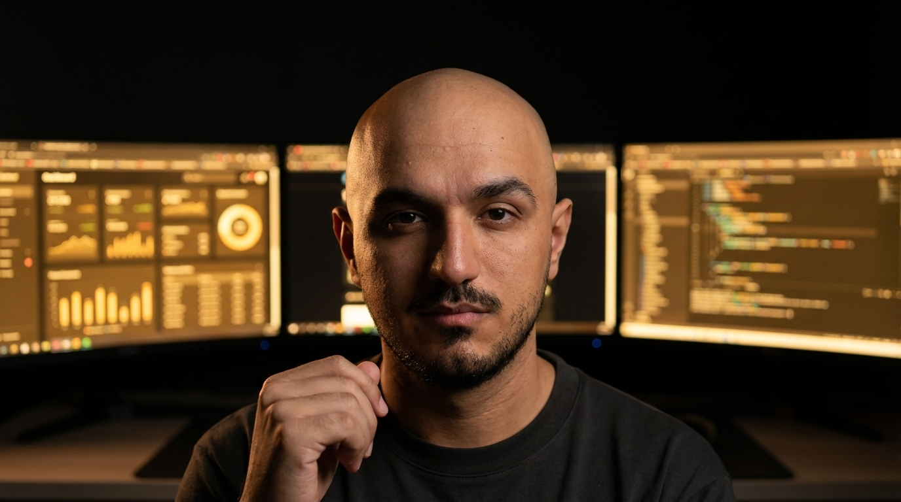
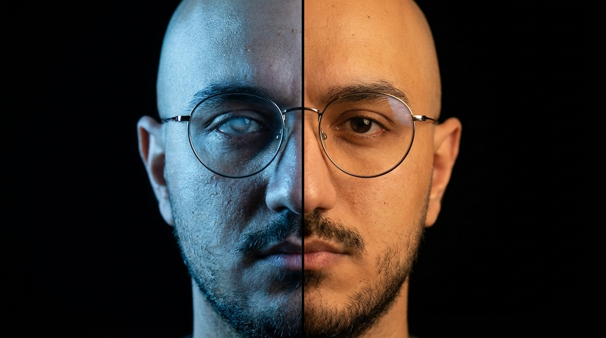

# Aesthetic Thumbnails

Aesthetic, photorealistic YouTube thumbnails — researched, designed, and generated by AI in a single session.

<table>
  <tr>
    <th>Artistic</th>
    <th>Enviroment</th>
    <th>Extreme</th>
    <th>Text & Icons</th>
  </tr>
  <tr>
    <td></td>
    <td></td>
    <td></td>
    <td></td>
  </tr>
  <tr>
    <td></td>
    <td></td>
    <td></td>
    <td></td>
  </tr>
  <tr>
    <td></td>
    <td></td>
    <td></td>
    <td></td>
  </tr>
</table>

> Every image above was generated from a single headshot + a topic description. No Photoshop. No templates.

---

## Quick Start

**Requirements:** [Python 3.10+](https://python.org) · [Claude Code](https://claude.ai/download) · [Gemini API key](https://ai.google.dev) (free)

```bash
git clone https://github.com/younessili/aesthetic-thumbnails.git
cd aesthetic-thumbnails
```

Open Claude Code in the folder and paste:

> **I just cloned this repo. I want to set up and make my first thumbnail. Walk me through everything — API keys, headshots, brand setup, and then let's make one.**

Pim (the creative director built into this tool) takes it from there.

---

## How It Works

3-phase creative workflow. Not a template filler.

| Phase | What happens |
|-------|-------------|
| **1. Research** | Finds outlier thumbnails in your niche. Studies what's working, what's not, and where the visual gap is. |
| **2. Concept Design** | Proposes 2-3 visual metaphor concepts — each with mood, color palette, and headshot selection. Grounded in research + visual psychology. |
| **3. Refine** | Generates photorealistic thumbnails, auto-evaluates against 12 quality checkpoints, pairs each with 3 title options, and previews across YouTube contexts (desktop, mobile, TV). |

<details>
<summary><b>What's inside the repo</b></summary>
<br>

| File | What it does |
|------|-------------|
| `CLAUDE.md` | The brain — Pim's persona, setup wizard, and workflow routing |
| `prompt.md` | Full 3-phase execution manual (research → concepts → refine) |
| `learnings.md` | Grows smarter with each session — stores creative patterns |
| `execution/` | Python scripts: image generation, outlier research, headshot indexing, preview viewer |
| `context/` | Visual psychology, aesthetic theory, title guide, brand reference |
| `assets/headshots/` | Your headshot photos (added during setup) |
| `assets/inspiration/` | Thumbnails you admire — optional, informs concept design |
| `output/` | Generated thumbnails land here, organized by date and video |

</details>

---

## Cost

| Operation | Estimated Cost |
|-----------|---------------|
| Thumbnail generation | ~$0.134 per image |
| Outlier research | Free (YouTube API) |
| Headshot analysis | ~$0.002 per image |
| **Typical session** | **$1.50 - $2.50** |

All API keys stay local — stored in your `.env` file, never uploaded.

---

## Questions?

Join the [newsletter](https://newsletter.aliyounessi.com) and reply to any email. Open a [GitHub issue](https://github.com/younessili/aesthetic-thumbnails/issues). Or DM me on social.

---

## Credits

Built by [Ali Younessi](https://aliyounessi.com) / [OperateU](https://aliyounessi.com).

[YouTube](https://youtube.com/@Ali_Younessi) · [Instagram](https://instagram.com/ali_younessi) · [Newsletter](https://newsletter.aliyounessi.com)

---

## License

MIT — free to use, customize, and fork.

This tool is actively developed. Future updates are free via `git pull`. Customizing core files may cause update conflicts — most people use it as-is.
